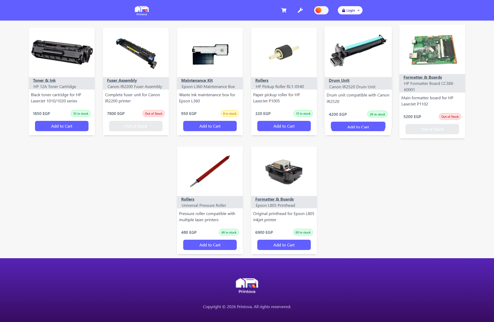
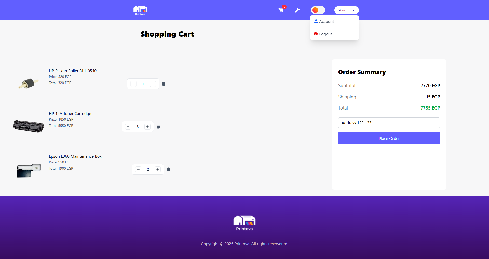
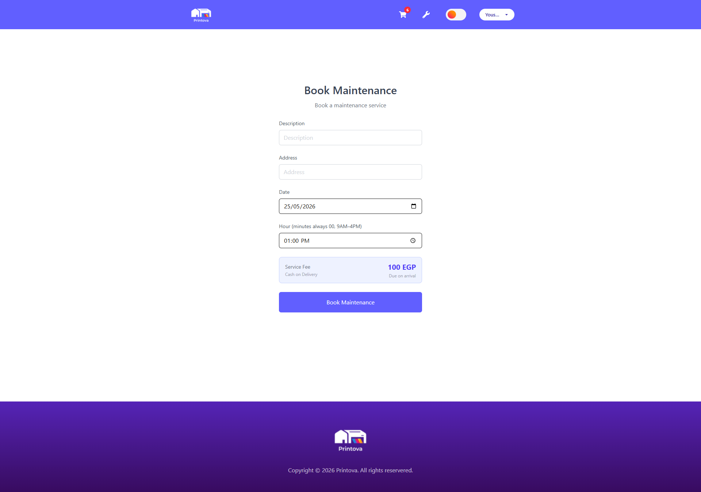
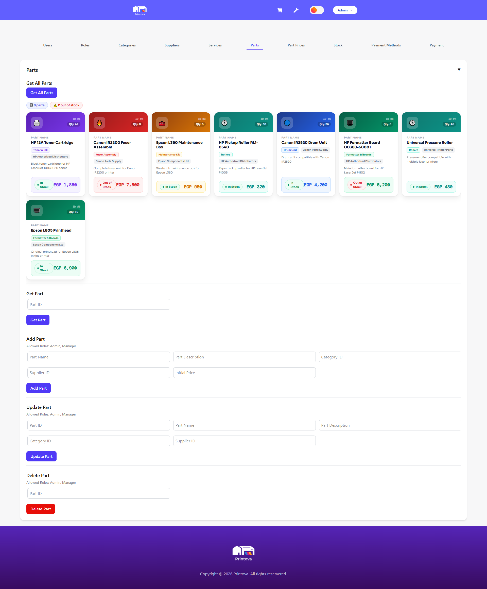

<div align="center">


# Printova

### 🖨️ Printer Spareparts E-Commerce & Maintenance Booking Platform

[](https://nextjs.org/)
[](https://spring.io/projects/spring-boot)
[](https://supabase.com/)
[](https://www.typescriptlang.org/)
[](https://tailwindcss.com/)
[](https://vercel.com/)
[](https://render.com/)

**[🌐 Live Demo](https://printova.vercel.app)** · **[📖 API Docs](https://printova-api.onrender.com/swagger-ui/index.html)** · **[🐛 Report Bug](https://github.com/youssefry01/printova/issues)**

</div>

---

## 📋 Table of Contents

- [Overview](#-overview)
- [Features](#-features)
- [Tech Stack](#tech-stack)
- [System Architecture](#system-architecture)
- [Role-Based Access Control](#-role-based-access-control)
- [API Reference](#-api-reference)
- [Project Structure](#-project-structure)
- [Getting Started](#-getting-started)
- [Environment Variables](#-environment-variables)
- [Deployment](#-deployment)
- [Database Schema](#database-schema)
- [Screenshots](#-screenshots)

---

## 🔍 Overview

**Printova** is a full-stack web platform that combines an e-commerce storefront for printer spare parts with an integrated maintenance booking system. Customers can browse and purchase parts, track orders, and schedule on-site maintenance appointments — all in one place.

The platform is built around a robust role hierarchy (Admin, Manager, Technician, Delivery, Customer), with each role having a dedicated dashboard and tightly scoped permissions enforced at the API level via JWT-based authentication.

---

## ✨ Features

### 🛒 E-Commerce

- Browse printer spare parts with real-time stock indicators (color-coded: green/yellow/orange/red)
- Add to cart, update quantities, remove items, or clear the whole cart
- Checkout with delivery address, with automatic delivery personnel assignment
- Order history with status filtering (`PENDING`, `COMPLETED`, `CANCELLED`)
- Price snapshots — historical order prices are preserved even after price changes

### 🔧 Maintenance Booking

- Book maintenance appointments with description, address, date & time
  - Time constraints: on the hour only, between **9:00 AM – 4:00 PM**
- Available technician auto-assigned on booking confirmation
- Technicians can only complete appointments once the scheduled time has passed
- View maintenance history with status filtering

### 👤 User Account

- Register & login with JWT authentication (access + refresh token)
- Profile page: update personal info, change password
- View order and maintenance history in one place
- Dark / Light mode toggle

### 🖥️ Role Dashboards

| Role | Capabilities |
|---|---|
| **Admin** | Full system access — users, roles, inventory, payments, system config |
| **Manager** | Manage products, categories, suppliers, stock, services, prices |
| **Technician** | View & complete assigned maintenance appointments |
| **Delivery** | View & complete assigned delivery orders |

---

## Tech Stack

### Frontend

| Technology | Version | Purpose |
|---|---|---|
| [Next.js](https://nextjs.org/) | 16 | React framework (App Router) |
| [TypeScript](https://www.typescriptlang.org/) | 5 | Type safety |
| [Tailwind CSS](https://tailwindcss.com/) | 4 | Utility-first styling |
| [styled-components](https://styled-components.com/) | 6 | Component-level styles |
| [Axios](https://axios-http.com/) | 1.16 | HTTP client |
| [jwt-decode](https://github.com/auth0/jwt-decode) | 4 | Token decoding |
| [date-fns](https://date-fns.org/) | 4 | Date utilities |
| [react-icons](https://react-icons.github.io/react-icons/) | 5 | Icon library |

### Backend

| Technology | Purpose |
|---|---|
| [Java Spring Boot](https://spring.io/projects/spring-boot) | REST API framework |
| [Spring Security + JWT](https://spring.io/projects/spring-security) | Authentication & authorization |
| [Spring Data JPA / Hibernate](https://spring.io/projects/spring-data-jpa) | ORM & database access |
| [Springdoc OpenAPI (Swagger)](https://springdoc.org/) | API documentation |

### Infrastructure

| Service | Provider |
|---|---|
| Frontend Hosting | [Vercel](https://vercel.com/) |
| Backend Hosting | [Render](https://render.com/) |
| Database | [Supabase](https://supabase.com/) (PostgreSQL) |

---

## System Architecture

```
┌─────────────────────────────────────────────────────────────┐
│                     Presentation Layer                       │
│               Next.js 16 (TypeScript + Tailwind)            │
│          Vercel · Role-based dashboards · Dark/Light        │
└─────────────────────┬───────────────────────────────────────┘
                      │ REST API (HTTP/JSON + JWT)
┌─────────────────────▼───────────────────────────────────────┐
│                    Application Layer                         │
│              Spring Boot (Java) · Render                     │
│   Controllers → Services → Repositories (JPA/Hibernate)     │
└─────────────────────┬───────────────────────────────────────┘
                      │ JPA / JDBC
┌─────────────────────▼───────────────────────────────────────┐
│                       Data Layer                             │
│           PostgreSQL (Supabase) · ACID Compliant            │
│       Price history · Order records · Payment tracking      │
└─────────────────────────────────────────────────────────────┘
```

The backend follows a strict **3-tier layered architecture**:

- **Controller Layer** — Handles HTTP routing and request mapping
- **Service Layer** — Enforces business logic, RBAC, price snapshots, auto-assignment
- **Repository Layer** — Manages all database interactions via Spring Data JPA

---

## 🔐 Role-Based Access Control

Printova uses JWT-based authentication with a strict role hierarchy:

```
Admin
  └── Manager
        ├── Technician
        ├── Delivery
        └── Customer (default)
```

**Key rules:**

- A user can hold **multiple roles simultaneously**
- The first admin account (`admin@printova.com`) has a permanent Admin role that cannot be removed
- Only an **Admin** can assign the Admin role
- **Managers** can assign: Technician, Delivery, Customer
- Normal users cannot assign any roles
- All role enforcement is validated server-side on every request

---

## 📡 API Reference

Full interactive documentation available at: **[Swagger UI →](https://printova-api.onrender.com/swagger-ui/index.html)**

### Endpoint Summary

<details>
<summary><strong>Auth</strong> — <code>/api/auth</code></summary>

| Method | Endpoint | Description | Auth |
|---|---|---|---|
| `POST` | `/api/auth/register` | Register new user | Public |
| `POST` | `/api/auth/login` | Login & receive JWT | Public |
| `POST` | `/api/auth/refresh-token` | Refresh access token | Public |
| `POST` | `/api/auth/change-password` | Change password | 🔒 |
| `GET` | `/api/auth/me` | Get current user info | 🔒 |

</details>

<details>
<summary><strong>Users</strong> — <code>/api/user</code></summary>

| Method | Endpoint | Description | Auth |
|---|---|---|---|
| `GET` | `/api/user` | Get all users | 🔒 Admin |
| `GET` | `/api/user/{userId}` | Get user by ID | 🔒 Admin / Own |
| `PUT` | `/api/user/{userId}` | Update user | 🔒 Admin / Own |

</details>

<details>
<summary><strong>Roles</strong> — <code>/api/roles</code></summary>

| Method | Endpoint | Description | Auth |
|---|---|---|---|
| `GET` | `/api/roles` | Get all roles | 🔒 Admin |
| `POST` | `/api/roles` | Create role | 🔒 Admin |
| `GET` | `/api/roles/{roleId}` | Get role by ID | 🔒 Admin |
| `GET` | `/api/roles/user/{userId}` | Get user's roles | 🔒 Admin |
| `POST` | `/api/roles/user/{userId}` | Assign role to user | 🔒 Admin / Manager |
| `DELETE` | `/api/roles/user/{userId}` | Remove role from user | 🔒 Admin / Manager |

</details>

<details>
<summary><strong>Spare Parts</strong> — <code>/api/part</code></summary>

| Method | Endpoint | Description | Auth |
|---|---|---|---|
| `GET` | `/api/part` | Get all spare parts | Public |
| `GET` | `/api/part/{partId}` | Get part by ID | Public |
| `POST` | `/api/part` | Add spare part | 🔒 Admin / Manager |
| `PUT` | `/api/part/{partId}` | Update spare part | 🔒 Admin / Manager |
| `DELETE` | `/api/part/{partId}` | Delete spare part | 🔒 Admin / Manager |

</details>

<details>
<summary><strong>Cart</strong> — <code>/api/cart</code></summary>

| Method | Endpoint | Description | Auth |
|---|---|---|---|
| `GET` | `/api/cart` | Get current cart | 🔒 Customer |
| `POST` | `/api/cart` | Add item to cart | 🔒 Customer |
| `PUT` | `/api/cart/item/{partId}` | Update item quantity | 🔒 Customer |
| `DELETE` | `/api/cart/item/{partId}` | Remove cart item | 🔒 Customer |
| `DELETE` | `/api/cart/clear` | Clear entire cart | 🔒 Customer |

</details>

<details>
<summary><strong>Orders</strong> — <code>/api/order</code></summary>

| Method | Endpoint | Description | Auth |
|---|---|---|---|
| `POST` | `/api/order` | Create order (checkout) | 🔒 Customer |
| `GET` | `/api/order` | Get my orders | 🔒 Customer |
| `GET` | `/api/order/{orderId}` | Get order by ID | 🔒 Customer |
| `GET` | `/api/order/delivery` | Get assigned deliveries | 🔒 Delivery |
| `PATCH` | `/api/order/delivery/complete/{orderId}` | Complete delivery | 🔒 Delivery |

</details>

<details>
<summary><strong>Maintenance</strong> — <code>/api/maintenance</code></summary>

| Method | Endpoint | Description | Auth |
|---|---|---|---|
| `POST` | `/api/maintenance` | Book maintenance | 🔒 Customer |
| `GET` | `/api/maintenance` | Get my maintenances | 🔒 Customer |
| `GET` | `/api/maintenance/{maintenanceId}` | Get maintenance by ID | 🔒 Customer |
| `GET` | `/api/maintenance/technician` | Get assigned tasks | 🔒 Technician |
| `PATCH` | `/api/maintenance/technician/complete/{maintenanceId}` | Complete maintenance | 🔒 Technician |

</details>

<details>
<summary><strong>Stock, Categories, Suppliers, Services, Prices, Payments</strong></summary>

| Resource | Base Path | Access |
|---|---|---|
| Categories | `/api/category` | Read: Public · Write: Admin/Manager |
| Suppliers | `/api/supplier` | Admin / Manager |
| Stock | `/api/stock` | Admin / Manager |
| Part Prices | `/api/part-price` | Read latest: Public · Manage: Admin/Manager |
| Services | `/api/service` | Read: Public · Write: Admin/Manager |
| Payment Methods | `/api/payment-method` | Admin / Manager |
| Payments | `/api/payment` | Admin / Manager |

</details>

---

## 📁 Project Structure

```bash
printova/
├── frontend/                     # Next.js frontend application
├── backend/                      # Spring Boot REST API
├── docs/
│   ├── Printova Documentation.pdf
│   ├── diagrams/                 # System architecture & ERD diagrams
│   └── screenshots/              # README and project screenshots
└── README.md
```

### Repository Layout

- **frontend/** — Contains the Next.js 16 client application, dashboards, UI components, authentication handling, and API integration.
- **backend/** — Contains the Spring Boot backend, REST controllers, business logic, security configuration, and database access layer.
- **docs/** — Project documentation, architecture diagrams, screenshots, and supporting materials.
- **README.md** — Main project overview and setup guide.

---

## 🚀 Getting Started

### Prerequisites

- Node.js 18+
- Java 17+
- Maven
- PostgreSQL (or a Supabase project)

### 1. Clone the Repository

```bash
git clone https://github.com/youssefry01/printova.git
cd printova
```

### 2. Backend Setup

```bash
cd backend
# Configure your environment variables (see below)
./mvnw spring-boot:run
```

The API will be available at `http://localhost:8080`.
Swagger UI: `http://localhost:8080/swagger-ui/index.html`

### 3. Frontend Setup

```bash
cd frontend
npm install
npm run dev
```

The app will be available at `http://localhost:3000`.

---

## 🔑 Environment Variables

### Backend (`application-dev.properties` / environment)

```properties
# Database
spring.datasource.url=jdbc:postgresql://<host>:<port>/<database>
spring.datasource.username=<username>
spring.datasource.password=<password>

# JWT
jwt.secret=<your-256-bit-secret>
jwt.expiration=86400000
jwt.refresh-expiration=604800000

# JPA
spring.jpa.hibernate.ddl-auto=update
spring.jpa.show-sql=false
```

### Frontend (`.env.local`)

```env
NEXT_PUBLIC_API_URL=http://localhost:8080
```

---

## 🌐 Deployment

| Layer | Platform | Notes |
|---|---|---|
| Frontend | [Vercel](https://vercel.com/) | Auto-deploys on push to `main` |
| Backend | [Render](https://render.com/) | Free tier — may have cold starts (~30s) |
| Database | [Supabase](https://supabase.com/) | Managed PostgreSQL, connection pooling enabled |

> ⚠️ **Note:** The backend is hosted on Render's free tier. The first request after inactivity may take ~30 seconds to wake the service.

---

## Database Schema

The system uses a fully normalized (3NF) PostgreSQL schema with the following core tables:

```
Users ──────────── UserRole ─── Roles
  │
  ├── Cart ──────── CartItem ─── Stock ─── SparePart ─── Category
  │                                   │               └── Supplier
  │                                   └── PartPrice
  │
  ├── Order ─────── OrderItem ── Stock
  │     └── Payment
  │
  └── Maintenance
        └── Payment

Service (maintenance service fee)
PaymentMethod
OrderStatus / MaintenanceStatus / PaymentStatus
```

Key design decisions:

- **Price snapshots** on `Order` and `Maintenance` — historical prices are preserved when parts/services are repriced
- **Cascade deletes** on user, supplier, and category removal to prevent orphan records
- **Audit timestamps** (`created_at`, `updated_at`) on all transactional tables
- **Exclusive association** on `Payment` — linked to either an order OR a maintenance, never both

---

## 📸 Screenshots

### 🏠 Home Page

[](docs/screenshots/1.png)

---

### 🛒 Shopping Cart

[](docs/screenshots/4.png)

---

### 🛠️ Maintenance Booking

[](docs/screenshots/5.png)

---

### 👨‍💼 Admin Dashboard

[](docs/screenshots/8.png)

---

<div align="center">

Built with ❤ by [Youssef R.](https://github.com/youssefry01)

</div>
